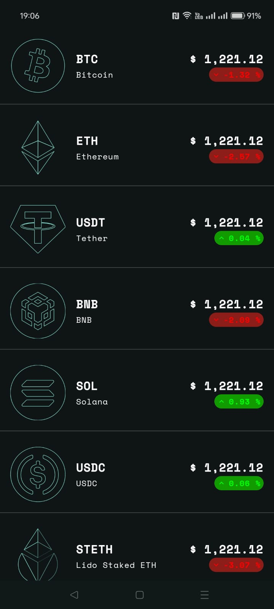
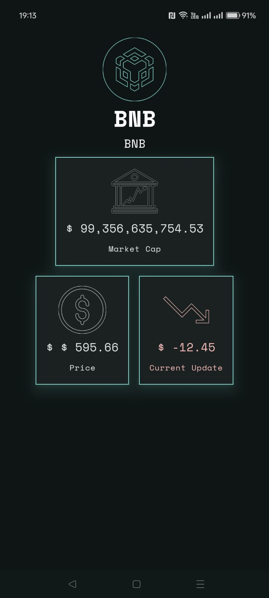

## Crypto Tracker App 

***

### Description

This app is shown an list of latest crypto currency that display :

- Price
- Name of coin
- Code of coin
- Market cap
- Current update market each coin

### Tech 📱

> - Kotlin
> - Jetpack Compose 
> - [Clean Architecture](https://blog.cleancoder.com/uncle-bob/2012/08/13/the-clean-architecture.html)
> - Combine [MVVM](https://www.dicoding.com/blog/tips-design-pattern-mvvm/) and [MVI](https://medium.com/@mohammedkhudair57/mvi-architecture-pattern-in-android-0046bf9b8a2e) Pattern 
> - [Ktor](https://www.dicoding.com/blog/mengembangkan-rest-api-dengan-ktor-simpel/)
> - Coin (Dependency Injector)
> - Material Theme

### Sample Display 
 \t

